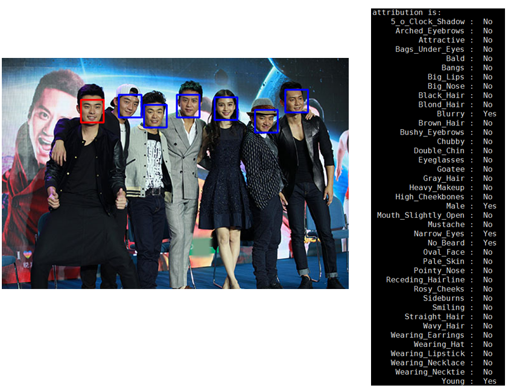

Using [MXNet](https://github.com/dmlc/mxnet) for Face-related Algorithm
-------------------------
-------------------------

About
--------
Using mxnet for face-related algorithm, here now only provide :
* a trained lightened cnn[1] model on **Face Identity**, together with the training script, the single model get *97.13%+-0.88%* accuracy on LFW, and with only 20MB size.
* a trained lightened moon[1][2] model (combine the changed lightened cnn and moon loss) on **Face Attribute Prediction**, together with the training script, the single model get about *87.41%* accuracy on CelebA, and with only 18MB size.


Before runing
-----------
```
cd model
./get-models.sh
```
* this will download the face alignned model used in [dlib](https://github.com/davisking/dlib), because in the face identification experiment, it will use face alignment technology before extractting face faceture.
* using my slightly changed mxnet branch [face](https://github.com/tornadomeet/mxnet/tree/face) for training.

Face Identification
-----------
##### How to test
run ```./test.sh``` in shell.  
This script will run the evaluation on lfw using trained model, the model needs 128x128 image size for input, you can using your own aligned lfw data, we also offered the [aligin-lfw dataset](http://pan.baidu.com/s/1qYDxeRq), passward : mg2i.  
before runing, you should change your own ```align_data_path``` in test.sh. the model

##### How to train
run ```./run.sh``` in shell.  
This script will train the lightened cnn face model, using [CASIA-WebFace](http://www.cbsr.ia.ac.cn/english/CASIA-WebFace-Database.html) dataset, more accurately, i used the [cleaned version](https://github.com/happynear/FaceVerification).  
Again, you should change with your own setting in run.sh, and using your own hyper-parameter when training the model.

##### Implemented details
* you should installed the [dlib](https://github.com/davisking/dlib) and [opencv](https://github.com/Itseez/opencv) libirary with python interface firstly.
* using dlib for face detection and alignment like [openface](https://cmusatyalab.github.io/openface/), but you can also choose opencv for detection, i have provided the detection model in ```model/opencv/cascade.xml```.
* 385504 images for train, and 20290 for val.
* run ```./model/get-models.sh``` to download the ```shape_predictor_68_face_landmarks.dat``` for face alignment.

##### How to improve accuracy on LFW?
* using more accurate aligned face images for trainig, currently the aligned face images for training has many mistake images, which will hurt the perfomance. you can using more powerful face detection and alignment for face processing.
* using more data
* add verification information
* ...

Face Attribute Prediction
-----------
##### How to prediction
```cd attribut```  
then put the image you want to predict with name aaa.jpg and run in shell:  
 ```python -u predict.py --img aaa.jpg```
 the example output will like this:  
 


-----------
##### How to test
run ```./test.sh``` in shell.
this script will run the evaluation on [CelebA](http://mmlab.ie.cuhk.edu.hk/projects/CelebA.html) dataset, the dataset is used for face attribute prediction, and each face image will have 40 binary attributes(labels), so we should using our model to predict the attribute of the test images in CelebA.  

##### How to train
run ```./run.sh``` in shell.   
This script will train the lightened moon face model, using [CelebA](http://mmlab.ie.cuhk.edu.hk/projects/CelebA.html) train and val dataset, we use the original image set, not the aligned set. so we should first using opencv and dlib to do face detection, enlarge the face area and then cropped it, we finally training the model using the cropped image.

##### Implemented details
* 159923 training face, less than original training number, which is 162770, this is because the cropping phase failed when using face detection.
* 19962 tesing face, less then original testing number,which is 19667 for the same reason
* the lightened moon model is combine changed lightened cnn[1] and moon loss[2], please refer to the symbol file in attribute/lightened_moon.py

##### How to improve accuracy on CelebA?
* using more accurate face deteciton or face alignment.
* using more data
* using more meaningful loss
* ...

Reference
---------
[1] Wu X, He R, Sun Z. A Lightened CNN for Deep Face Representation[J]. arXiv preprint arXiv:1511.02683, 2015.  
[2] Rudd E, Günther M, Boult T. MOON: A Mixed Objective Optimization Network for the Recognition of Facial Attributes[J]. arXiv preprint arXiv:1603.07027, 2016.
